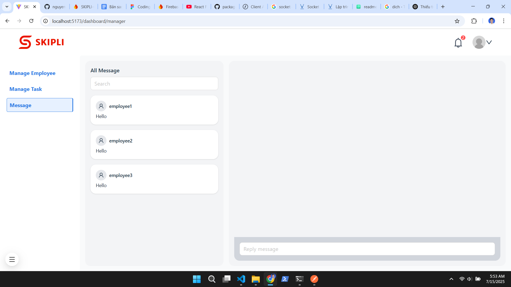

# SKIPLI_Challenge4_TranNguyenKhang

- https://docs.google.com/document/d/12hTItbxeJeVSiwICG0qtGjJ44Ocegh--0sgdCQws7As/edit?tab=t.0

## INFOMATIONS

- Full Name: Trần Nguyên Khang
- Email: nguyenkhangdev@gmail.com
- Company: SKIPLI

## License & Usage Terms

This project is submitted exclusively for evaluation purposes related to a full-stack developer position at SKIPLI.

Unauthorized use, reproduction, or adaptation of this source code for commercial or internal development purposes is strictly prohibited unless written permission is obtained from the author.

You may not use any part of this codebase in production or other hiring processes without consent.

Nếu quý công ty hoặc cá nhân có nhu cầu trao đổi, đánh giá hoặc sử dụng lại một phần mã nguồn, vui lòng liên hệ qua email nguyenkhangdev@gmail.com

## THANK YOU

Thank you for reviewing this project. I look forward to discussing the solution and your feedback in the next stage.

# SKIPLI_Challenge4_TranNguyenKhang

- Full Name: Trần Nguyên Khang
- Email: nguyenkhangdev@gmail.com
- Company: SKIPLI

# Real-Time Employee Task Management Tool

This is a full-stack web application for managing employees, assigning tasks, chatting in real-time, and handling user authentication. Built with React (frontend), Express (backend), and Firebase (database).

## Project Structure

```.
├── backend/                     # Express.js backend
│   ├── src/
│   │   ├── controllers/         # Handles request logic for routes
│   │   ├── middlewares/         # Custom middleware (auth, error handling, etc.)
│   │   ├── routes/              # Express route definitions
│   │   ├── services/            # Business logic, DB interactions, etc.
│   │   ├── firebaseAdminInfomation.js  # API key firebase admin
│   │   ├── utils/               # Utility/helper functions
│   │   └── index.js             # Entry point for the server
│   ├── .env-example             # Sample environment config for backend
│   ├── package-lock.json
│   └── package.json             # Backend dependencies and scripts
│
├── frontend/                    # React.js frontend
│   ├── public/                  # Static files and index.html
│   ├── src/
│   │   ├── assets/              # Images, icons, fonts, etc.
│   │   ├── components/          # Reusable UI components
│   │   ├── contexts/            # React Context API for global state
│   │   ├── layout/              # Layout components (PrivateRoute wrap, etc.)
│   │   ├── pages/               # Page-level components (signin, dashboard, etc.)
│   │   ├── services/            # API calls and service functions
│   │   ├── App.jsx              # Main App component
│   │   └── index.css            # Global styles
│   ├── .env-example             # Sample environment config for frontend
│   ├── package-lock.json
│   └── package.json             # Frontend dependencies and scripts
│
└── README.md                    # Project documentation
```

## How to run

- Create .env files in /client and /server as .emv-example
- Get file `firebaseAdminInfomation.js` in firebase admin and place it in `/backend/src/services`
- Run backend

```
cd backend
npm install
npm run dev
```

- Run frontend

```
cd backend
npm install
npm run dev
```

## Project Deliverables

- Assignment: https://docs.google.com/document/d/12hTItbxeJeVSiwICG0qtGjJ44Ocegh--0sgdCQws7As/edit?tab=t.0
- Postman colection: https://www.postman.com/lunar-rocket-501382/workspace/skipli-challenge4-trannguyenkhang/collection/29459136-42efbb27-1178-47a3-8362-3cec56115842?action=share&source=copy-link&creator=29459136
- Website Demo: https://skipli.nguyenkhangdev.id.vn
- Video Youtube:

# SKIPLI_Challenge4_TranNguyenKhang

- Full Name: Trần Nguyên Khang
- Email: nguyenkhangdev@gmail.com
- Company: SKIPLI

# Real-Time Employee Task Management Tool

This is a full-stack web application for managing employees, assigning tasks, chatting in real-time, and handling user authentication. Built with React (frontend), Express (backend), and Firebase (database).

## Project Structure

```.
├── backend/                     # Express.js backend
│   ├── src/
│   │   ├── controllers/         # Handles request logic for routes
│   │   ├── middlewares/         # Custom middleware (auth, error handling, etc.)
│   │   ├── routes/              # Express route definitions
│   │   ├── services/            # Business logic, DB interactions, etc.
│   │   ├── firebaseAdminInfomation.js  # API key firebase admin
│   │   ├── utils/               # Utility/helper functions
│   │   └── index.js             # Entry point for the server
│   ├── .env-example             # Sample environment config for backend
│   ├── package-lock.json
│   └── package.json             # Backend dependencies and scripts
│
├── frontend/                    # React.js frontend
│   ├── public/                  # Static files and index.html
│   ├── src/
│   │   ├── assets/              # Images, icons, fonts, etc.
│   │   ├── components/          # Reusable UI components
│   │   ├── contexts/            # React Context API for global state
│   │   ├── layout/              # Layout components (PrivateRoute wrap, etc.)
│   │   ├── pages/               # Page-level components (signin, dashboard, etc.)
│   │   ├── services/            # API calls and service functions
│   │   ├── App.jsx              # Main App component
│   │   └── index.css            # Global styles
│   ├── .env-example             # Sample environment config for frontend
│   ├── package-lock.json
│   └── package.json             # Frontend dependencies and scripts
│
└── README.md                    # Project documentation
```

## How to run

- Create .env files in /client and /server as .emv-example
- Get file `firebaseAdminInfomation.js` in firebase admin and place it in `/backend/src/services`
- Run backend

```
cd backend
npm install
npm run dev
```

- Run frontend

```
cd backend
npm install
npm run dev
```

## Project Deliverables

- Assignment: https://docs.google.com/document/d/12hTItbxeJeVSiwICG0qtGjJ44Ocegh--0sgdCQws7As/edit?tab=t.0
- Postman colection: https://www.postman.com/lunar-rocket-501382/workspace/skipli-challenge4-trannguyenkhang/collection/29459136-42efbb27-1178-47a3-8362-3cec56115842?action=share&source=copy-link&creator=29459136
- Website Demo: https://skipli.nguyenkhangdev.id.vn
- Video Youtube:

## Screenshots of application

- Home page  
  

- Sign in for manager  
  

- Verify code for manager  
  

- Dashboard for manager  
  

- Management employee  
  

- Create employee  
  

- Chat Message  
  

- Sign in for employee  
  

- Verify code for employee  
  

- Dashboard for employee  
  

## License & Usage Terms

This project is submitted exclusively for evaluation purposes related to a full-stack developer position at SKIPLI.

Unauthorized use, reproduction, or adaptation of this source code for commercial or internal development purposes is strictly prohibited unless written permission is obtained from the author.

You may not use any part of this codebase in production or other hiring processes without consent.

If your company or individual needs to discuss, evaluate or reuse part of the source code, please contact us via email nguyenkhangdev@gmail.com

## THANK YOU

Thank you for reviewing this project. I look forward to discussing the solution and your feedback in the next stage.

## License & Usage Terms

This project is submitted exclusively for evaluation purposes related to a full-stack developer position at SKIPLI.

Unauthorized use, reproduction, or adaptation of this source code for commercial or internal development purposes is strictly prohibited unless written permission is obtained from the author.

You may not use any part of this codebase in production or other hiring processes without consent.

If your company or individual needs to discuss, evaluate or reuse part of the source code, please contact us via email nguyenkhangdev@gmail.com

## THANK YOU

Thank you for reviewing this project. I look forward to discussing the solution and your feedback in the next stage.
